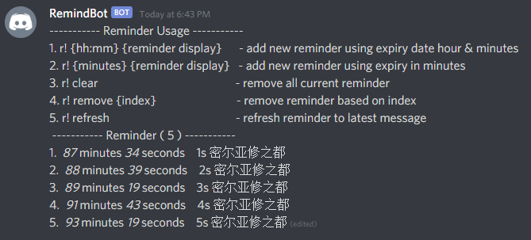

# RemindBot

A reminder bot mainly just for personally game purpose :)

# Development

Before start server, you need install [Deno](https://deno.land/). After installation setup those environment variables have stated at [Deployment](#deployment). Everything is setup done, then can start with.

```
$ deno run --allow-net --allow-env main.ts
```

# Deployment

Currently deployment is using github, you can fork your own and deploy to heroku. And fill in config variable in heroku.

```
SERVER_URL // your server endpoint ( for keep waking up dyno )
DISCORD_SECRET // bot token
DISCORD_CHANNEL // specify which channel to only use this
```

# Showcase

Interval have been removed due to will hit discord rate limit.

